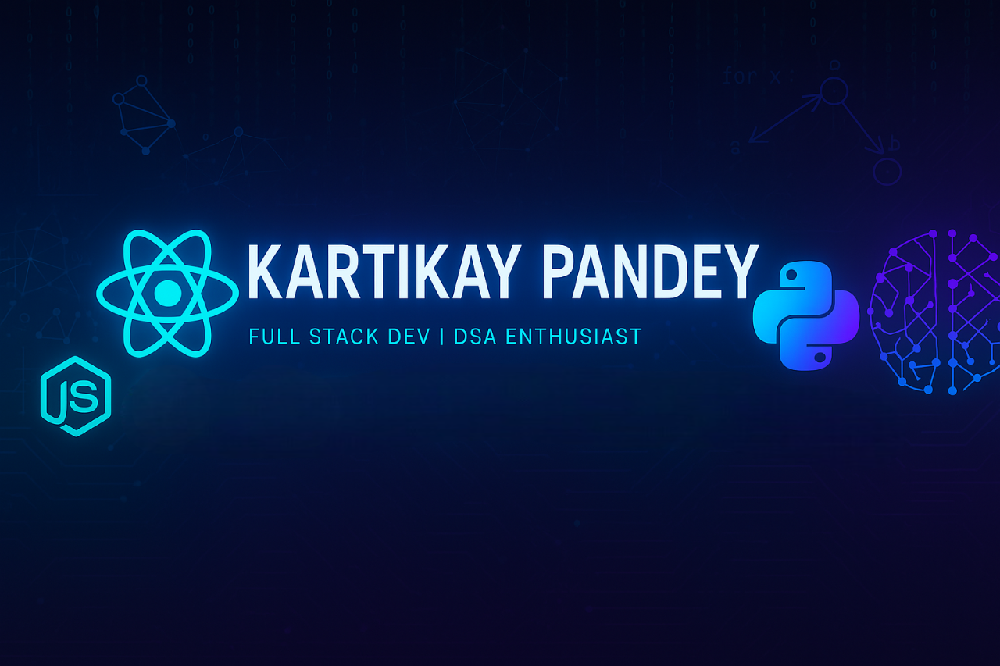

<!-- Banner -->

  

<h1 align="center">Hi 👋, I'm Kartikay Pandey</h1>
<h3 align="center">A Full Stack Developer, DSA Enthusiast & Tech Explorer from India 🇮🇳</h3>

- 🏫 Pursuing **B.Tech in Information Technology** at **VJTI, Mumbai**
- 💻 Passionate about **Full Stack Web Development**, **Competitive Programming**, and **Machine Learning**
- 🚀 Currently sharpening my skills in **MERN Stack**, **DSA**, and diving into the world of **ML & AI**
- 💬 Ask me about **React, Node.js, MongoDB, Express, Python, and more**
- 📫 Reach me at: **kartikay7905@gmail.com**
- ⚡ Fun fact: I once built a feature that worked on the first try. Still recovering from the shock.

---

<h3 align="left">🌐 Connect with me:</h3>

   
  
  

---

<h3 align="left">🚀 Languages & Tools I Use:</h3>

 

---

<h3 align="center">💬 Let's collaborate and create something amazing!</h3>
