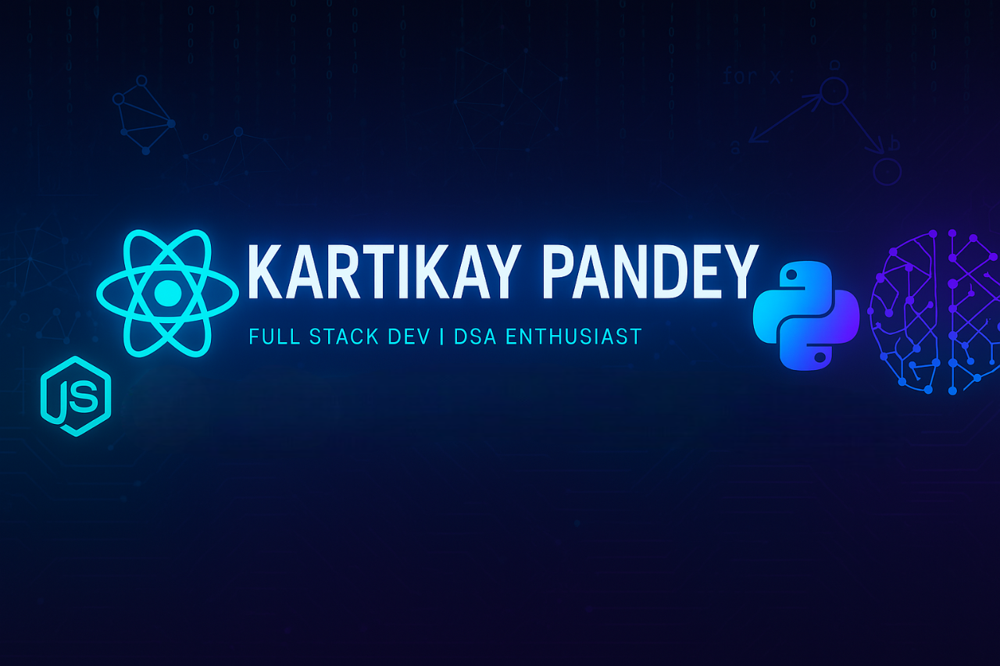

<!-- Banner -->

  

<h1 align="center">Hi 👋, I'm Kartikay Pandey</h1>
<h3 align="center">Full-Stack Developer | ICPC Regionalist '24 | Exploring Scalable Systems, Distributed Computing & AI</h3>

- 🏫 Pursuing **B.Tech in Information Technology** at **VJTI, Mumbai**
- 💻 Building full-stack applications with **MERN, Next.js, PostgreSQL, and Supabase**
- ⚙️ Currently learning **System Design, Distributed Systems**, and how large-scale systems handle reliability, scalability, and performance
- 🤖 Exploring **GenAI and Agentic AI**, and how intelligent systems can be integrated into real-world products
- 💬 Ask me about **DSA, Competitive Programming, React, Node.js, Databases, and System Design**
- 📫 Reach me at: **kartikay7905@gmail.com**
- 🧠 Fun fact: I enjoy solving CP problems, except when Test Case #2 has other plans.

---

<h3 align="left">🌐 Connect with me:</h3>

   
  
  

---

<table>
  <tr>
    <td><b>💻 Languages</b></td>
    <td>
      
    </td>
  </tr>

  <tr>
    <td><b>🌐 Frontend</b></td>
    <td>
      
    </td>
  </tr>

  <tr>
    <td><b>⚙️ Backend</b></td>
    <td>
      
    </td>
  </tr>

  <tr>
    <td><b>🗄️ Data & AI</b></td>
    <td>
      
    </td>
  </tr>

  <tr>
    <td><b>☁️ DevOps & Tools</b></td>
    <td>
      
    </td>
  </tr>
</table>

---

<h3 align="center">💬 Let's collaborate and create something amazing!</h3>
